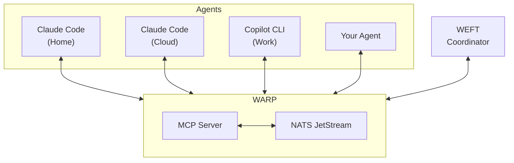

# Loominal

**Weaving AI agents together.**

[](https://opensource.org/licenses/MIT)
[](https://www.typescriptlang.org/)
[](https://nats.io/)
[]()

---

Loominal is infrastructure for multi-agent AI systems. Built on [NATS JetStream](https://nats.io/) and the [Model Context Protocol (MCP)](https://modelcontextprotocol.io/), it transforms isolated AI assistants into a coordinated fabric of collaborating agents.

## The Problem

Today's AI coding assistants are **islands**. Each Claude Code session, each GitHub Copilot instance operates in complete isolation. There's no way for them to:

- Share context or findings with other agents
- Hand off work based on capabilities or access rights
- Coordinate on complex, multi-part tasks
- Scale up or down based on workload

**Loominal weaves them together.**

## The Fabric



## Repositories

| Repository | Description |
|------------|-------------|
| **[warp](https://github.com/loominal/warp)** | MCP server providing 16 tools for agent communication — messaging backbone |
| **[weft](https://github.com/loominal/weft)** | Work coordinator with intelligent routing and dynamic agent spin-up |
| **[pattern](https://github.com/loominal/pattern)** | MCP server for persistent agent memory across sessions |
| **[tools](https://github.com/loominal/tools)** | Docker images and GitHub Actions workflows for CI/CD integration |
| **[loominal](https://github.com/loominal/loominal)** | Project overview and documentation |

## Quick Start

### 1. Start NATS

```bash
docker run -d --name nats -p 4222:4222 nats:latest -js
```

### 2. Configure Warp

Add to your Claude Code MCP config (`~/.claude/mcp.json`):

```json
{
  "mcpServers": {
    "loominal": {
      "command": "docker",
      "args": ["run", "-i", "--rm", "--network=host", "-e", "NATS_URL", "ghcr.io/loominal/warp:latest"],
      "env": {
        "NATS_URL": "nats://localhost:4222"
      }
    }
  }
}
```

### 3. Start Weaving

Your agents can now discover each other, send messages, and coordinate work across machines.

## Key Features

- **Channels** for broadcast messaging with persistent history
- **Agent Registry** for cross-computer agent discovery
- **Direct Messaging** for point-to-point communication
- **Work Queues** with capability-based routing
- **Dynamic Scaling** via SSH, Kubernetes, GitHub Actions

## Status

**Beta Release** — All core features implemented and tested. Ready for early adopters.

## License

MIT License

---

<p align="center">
  <b>Loominal</b> — Weaving AI agents together.
</p>
